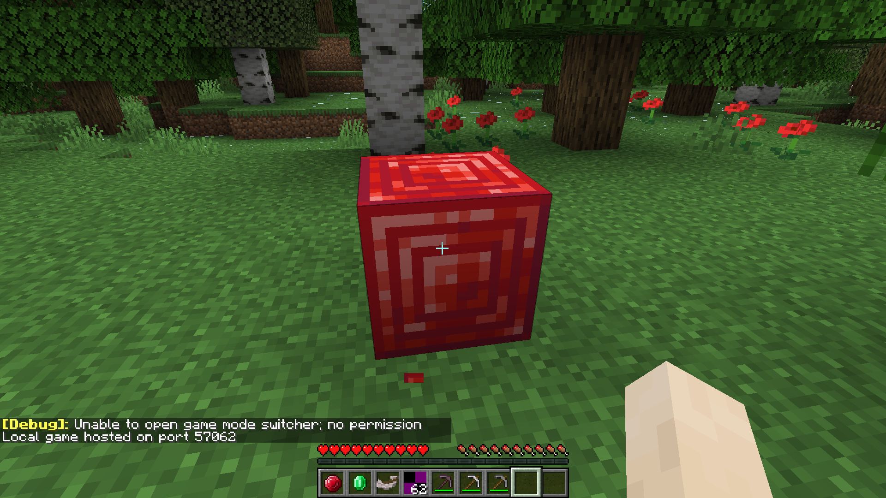

# Cave Update Mod for Fabric 1.16

This small test mod adds a ruby ore, which drops its mineral which can be turned into a block. It also adds a Horn which makes the ravager sound when used. Finally, it adds a copper pickaxe that's more durable than iron!

## Setup

For setup instructions please see the [fabric wiki page](https://fabricmc.net/wiki/tutorial:setup) that relates to the IDE that you are using.
